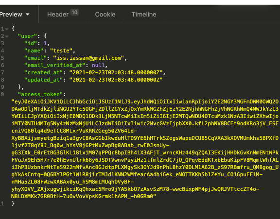
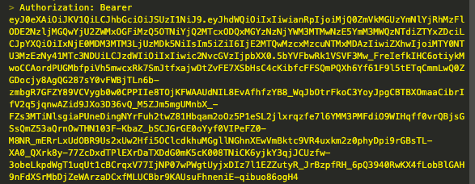

# Receiv Debits Manager v 1.0

## Sobre o Projeto

O projeto Receiv-debits-manager foi criado com base nas especificações fornecidas para o processo seletivo da empresa receiv. Onde o mesmo mostra por meio de um sistema de gestão de dividas como utilizar laravel para micro serviços. 

- Laravel v 8.x
- Mysql
- PHP
- Laravel Passport

## Iniciando o projeto

### Instalando as dependencias do projeto:

```
composer install
```

### Configurando banco de dados:

Para configurar o banco de dados edite o arquivo ".env" na raiz do projeto onde as seguintes variaveis de ambiente deverão ser alteradas:

DB_CONNECTION=mysql
DB_HOST=127.0.0.1
DB_PORT=3306
DB_DATABASE=nome_do_banco_de_dados
DB_USERNAME=nome_do_usuario
DB_PASSWORD=senha_do_usuario

Atenção: O projeto foi desenhado com base no banco de dados mysql, portanto para melhor aproveitamento utilize as configurações recomendadas.

### Gerando chaves Laravel Passport
```
php artisan passport:install
```

### Recriando banco de dados pre-configurado:
```
php artisan migrate:fresh
```

### Rodando em ambiente de desenvolvimento (local)

Para iniciar o servidor php embutido utilize o seguinte comando:

`````
php artisan serve
`````

Apos rodar do seguinte comando o servidor local estará disponivel.

## Endpoins Api

Para acessar aos recursos de manipulação de dados de devedores será necessario registar um usuário e realizar o cadastro de um novo usuário. E logo apos realizar sua autenticação para que os recursos desejados sejam acessados com segurança.

## Registrando um novo usuário (Obrigatorio)

Para registar um novo usuário utilize o seguinte endpoint:

Tipo de requisição: **POST**

```
http://localhost:8000/api/register
```

Com o seguinte corpo em formato JSON:
```
{
    "name": "teste",
    "email": "iss.iassam@gmail.com",
    "password": "senha123",
    "password_confirmation": "senha123"
}
```
Onde

name: Deverá ser o nome do usuário.
email: Email de contato do usuário utilizando para gerar o token de autenticação.
password: Senha de caracteres alfa numericos a escolha do usuário.
password_confirmation: Confirmação de senha de caracteres alfa numericos, onde a mesma deverá ser igual a fornecida no campo "password".

## Obtendo um token de autenticação

Para obter um token de autenticação utilize o seguinte endpoint:

Tipo de requisição: **POST**

```
http://localhost:8000/api/login
```

Com o seguinte corpo em formato JSON:
```
{
    "email": "usuario@email.com",
    "password": "senha_do_usuario"
}
```

onde:
email: deverá conter o email do usuário previamente cadastrado.
password: deverá conter a senha do usuário previamente cadastrado.

Em caso de sucesso um token de autenticação será retornado "access_token".



# Endpoints Devedores

Para acessar os endpoints a baixo utilizar o "access_token" fornecido pelo endpoint de login no cabeçalho "Autorization" com o seguinte valor "Bearer token_fornecido".



## Cadastrando um novo Devedor
Para cadastrar um novo devedor utilize o seguinte endpoint:

Tipo de requisição: **POST**

```
http://localhost:3333/api/debtors
```

com o seguinte corpo em formato JSON:

```
{
    "nome": "nome do devedor",
    "cpf_cnpj": "12312312",
    "data_nascimento": "2021-02-22",
    "endereco": "endereco devedor",
    "descricao_titulo": "teste de titulo",
    "valor": "1000.13",
    "data_vencimento": "2021-02-22",
    "updated": "2021-02-22T19:24:29-05:00"
}
```

## Listagem de Devedores
Para listar os devedores cadastrados utilizar o seguinte endpoint:

Tipo de requisição: **GET**

```
http://localhost:3333/api/debtors
```

## Visualizando um Devedor
Para visualizar as informações cadastrais de um devedor o seguinte endpoint:

Tipo de requisição: **GET**

```
http://localhost:3333/api/debtors/<debtor_id>
```

onde
"debtor_id" devera ser substituido pelo id do devedor desejado.

## Atualizando os dados de um Devedor
Para atualizar os dados cadastrais de um devedor utilize o seguinte endpoint:

Tipo de requisição: **PUT**

```
http://localhost:3333/api/debtors/<debtor_id>
```

onde
"debtor_id" devera ser substituido pelo id do devedor desejado.

com o seguinte corpo em formato JSON:

```
{
    "nome": "nome do devedor",
    "cpf_cnpj": "12312312",
    "data_nascimento": "2021-02-22",
    "endereco": "endereco devedor",
    "descricao_titulo": "teste de titulo",
    "valor": "1000.13",
    "data_vencimento": "2021-02-22",
    "updated": "2021-02-22T19:24:29-05:00"
}
```

## Removendo um Devedor
Para excluir um devedor utilize o seguinte endpoint:

Tipo de requisição: **DELETE**

```
http://localhost:3333/api/debtors/<debtor_id>
```

onde
"debtor_id" devera ser substituido pelo id do devedor desejado.

com o seguinte corpo em formato JSON:

```
{
    "nome": "nome do devedor",
    "cpf_cnpj": "12312312",
    "data_nascimento": "2021-02-22",
    "endereco": "endereco devedor",
    "descricao_titulo": "teste de titulo",
    "valor": "1000.13",
    "data_vencimento": "2021-02-22",
    "updated": "2021-02-22T19:24:29-05:00"
}
```
